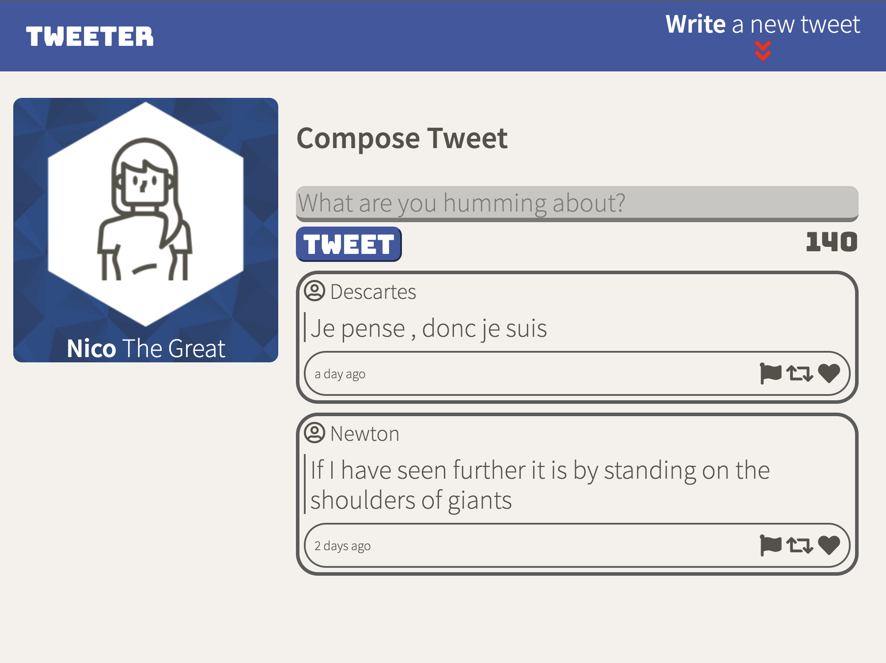
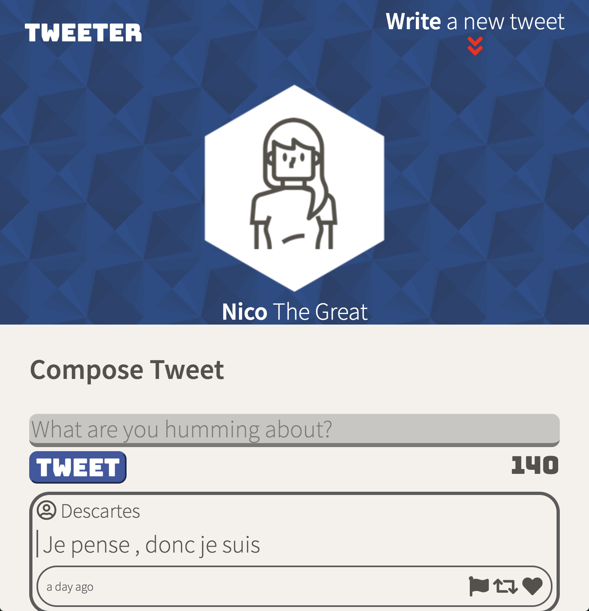
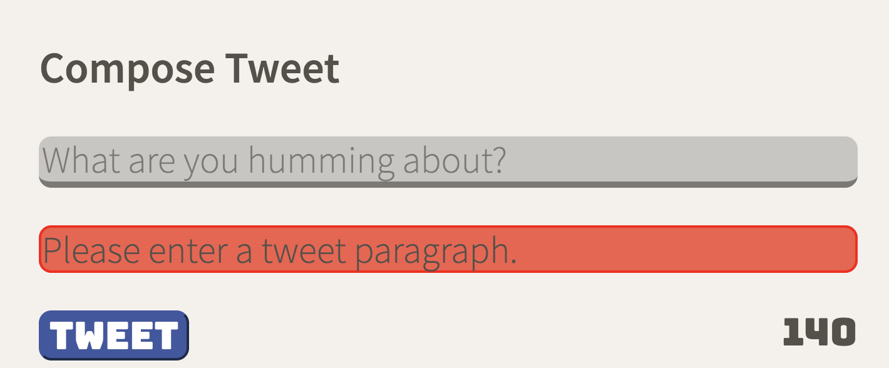

# Tweeter Project

Tweeter is a simple, single-page Twitter app.

This app is designed to get messages from different users without announcing their identity.
The app was built using HTML, CSS, JS, jQuery, AJAX, Node, and Express.

Easy to use and interact with using multiple types of devices. It was designed to make the user comfortable using it on PC and mobile devices.

Feel free to fork and clone this project if you would like to modify it and apply some cool features.
To get started see the instructions below:

## Getting Started

1. [Create](https://docs.github.com/en/repositories/creating-and-managing-repositories/creating-a-repository-from-a-template) a new repository using this repository as a template.
2. Clone your repository onto your local device.
3. Install dependencies using the `npm install` command.
3. Start the web server using the `npm run local` command. The app will be served at <http://localhost:8080/>.
4. Go to <http://localhost:8080/> in your browser.

## Dependencies

- Express
- Node 5.10.x or above
- body-parser
- chance
- cookie-session
- i
- md5

## Closer look

1. Desktop view

2. Mobile view

3. Error Notifications
